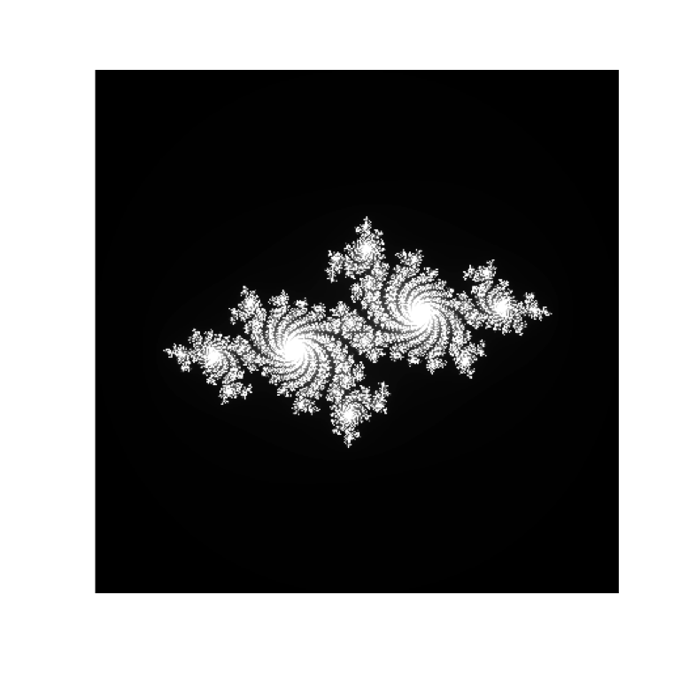
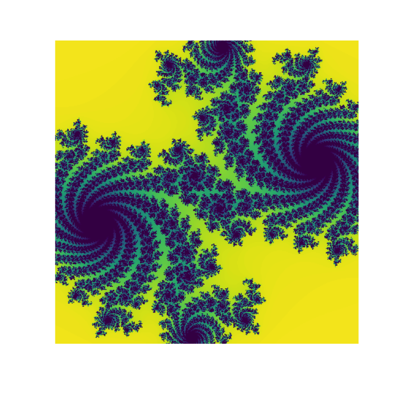
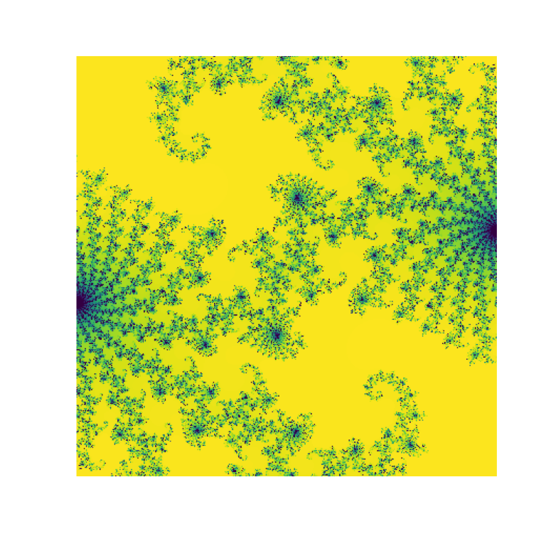
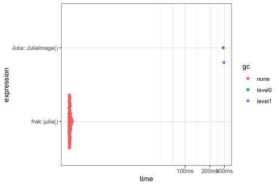

<!-- README.md is generated from README.Rmd. Please edit that file -->

# frak 

<!-- badges: start -->


[](https://github.com/coolbutuseless/frak/actions/workflows/R-CMD-check.yaml)
<!-- badges: end -->

`frak` is a small R package to generate fractals - currently just [Julia
Sets](https://en.wikipedia.org/wiki/Julia_set).

I needed a fast way to generate test images for testing other software,
with images that

- are fast to produce
- are interesting, not just white noise
- 8-bits-per-pixel, so the value can fit in an R `raw` vector or a C
  `uint8_t` vector.
- can be be panned, zoomed and changed with simple changes to the input
  variables

## Installation

You can install from [GitHub](https://github.com/coolbutuseless/frak)
with:

``` r
# install.packages('remotes')
remotes::install_github('coolbutuseless/frak')
```

## What’s in the box?

- `julia(cx, cy, movex, movey, zoom, size, max_iter)` generate a julia
  set, where `cx` and `cy` are the components of imaginary iteration
  variable *c*.

Returned array of raw values represents the iteration count at which a
particular location veered towards infinity. These values are scaled to
span the full range from allowable within a raw vector (i.e. the whole
numbers from 0 to 255)

## Example: Generate a julia set

``` r
library(frak)

fractal <- julia(cx = -0.7, cy = 0.27, zoom = 1, size = 400, max_iter = 255)
mode(fractal) <- 'integer'
plot(as.raster(fractal/255))
```



## Example: colour the image with viridis

``` r
library(viridisLite)

# generate a fractal
fractal <- julia(cx = -0.74, cy = 0.17, zoom = 3, size = 400, max_iter = 300)
mode(fractal) <- 'integer'

# Grab a palette from viridis
pal <- rev(viridisLite::viridis(256))

# Recode the values with the palette. Lowest raw value is 0, so offset by 1.
fractal_raster   <- fractal
fractal_raster[] <- pal[fractal_raster + 1]

plot(as.raster(fractal_raster))
```



## Example with gamma correction



## Example with histogram equalization

Histogram equalization can help enhance the contrast of the result,
especially if there is a wide variation in iterations across the image.


## Example: git file rendered from multiple frames

<details>

<summary>

Click to show/hide code to generate gif
</summary>

``` r
# install.package('remotes')
# remotes::install_github('coolbutuseless/displease')
# remotes::install_github('coolbutuseless/foist')
library(foist)
library(displease)
library(frak)

dir.create('man/figures/anim', showWarnings = FALSE)

#~~~~~~~~~~~~~~~~~~~~~~~~~~~~~~~~~~~~~~~~~~~~~~~~~~~~~~~~~~~~~~~~~~~~~~~~~~~~~
# Use {displease} to get a pleasing motion as the zoom is performed
#~~~~~~~~~~~~~~~~~~~~~~~~~~~~~~~~~~~~~~~~~~~~~~~~~~~~~~~~~~~~~~~~~~~~~~~~~~~~~
N <- 100
zoom <- displease::seq_ease(1, 1000, n = N, type = 'exp-in')

#~~~~~~~~~~~~~~~~~~~~~~~~~~~~~~~~~~~~~~~~~~~~~~~~~~~~~~~~~~~~~~~~~~~~~~~~~~~~~
# Loop: create an image dump it to file.
# Using {foist} here for fast image output
#~~~~~~~~~~~~~~~~~~~~~~~~~~~~~~~~~~~~~~~~~~~~~~~~~~~~~~~~~~~~~~~~~~~~~~~~~~~~~
for (i in seq(N)) {
  frac <- frak::julia(cx = -0.71, zoom = zoom[i], movex = 0.1, equalize = TRUE)
  mode(frac) <- 'integer'
  frac <- frac/255
  
  filename <- sprintf("man/figures/anim/%03i.png", i)
  
  foist::write_png(
    data                 = frac, 
    filename             = filename, 
    pal                  = foist::vir$magma, 
    convert_to_row_major = FALSE
  )
}

#~~~~~~~~~~~~~~~~~~~~~~~~~~~~~~~~~~~~~~~~~~~~~~~~~~~~~~~~~~~~~~~~~~~~~~~~~~~~~
# Create the animation using imagemagick and delete the source frames
#~~~~~~~~~~~~~~~~~~~~~~~~~~~~~~~~~~~~~~~~~~~~~~~~~~~~~~~~~~~~~~~~~~~~~~~~~~~~~
system("convert man/figures/anim/*.png man/figures/anim.gif")
unlink("man/figures/anim/", recursive = TRUE)
```

</details>


## Benchmark

Creating a julia set in C is about 100x faster than using plain R (as in
the [Julia](https://cran.r-project.org/package=Julia) package on CRAN)

<details>

<summary>

Click to show/hide bench::mark() code
</summary>

``` r
suppressPackageStartupMessages({
  library(Julia)
  library(frak)
  library(ggplot2)
  library(dplyr)
  library(tidyr)
})

size <- 400

# Julia::JuliaImage does at most 50 iterations
res <- bench::mark(
  `Julia::JuliaImage()` = Julia::JuliaImage(imageN = size, centre = 0.0, L = 4, C = 1-1.6180339887),
  `frak::julia()`       = julia(size = size, max_iter = 50),
  check = FALSE
)
#> Warning: Some expressions had a GC in every iteration; so filtering is
#> disabled.
```

</details>

| expression          |      min |   median |    itr/sec |
|:--------------------|---------:|---------:|-----------:|
| Julia::JuliaImage() | 290.03ms | 293.23ms |   3.410346 |
| frak::julia()       |   3.88ms |   3.96ms | 250.957374 |



## Related Software

- [mandelbrot](https://cran.r-project.org/package=mandelbrot) - Generate
  view on the Mandelbrot Set.
- [Julia](https://cran.r-project.org/package=Julia) - a Pure R Julia Set
  generator
